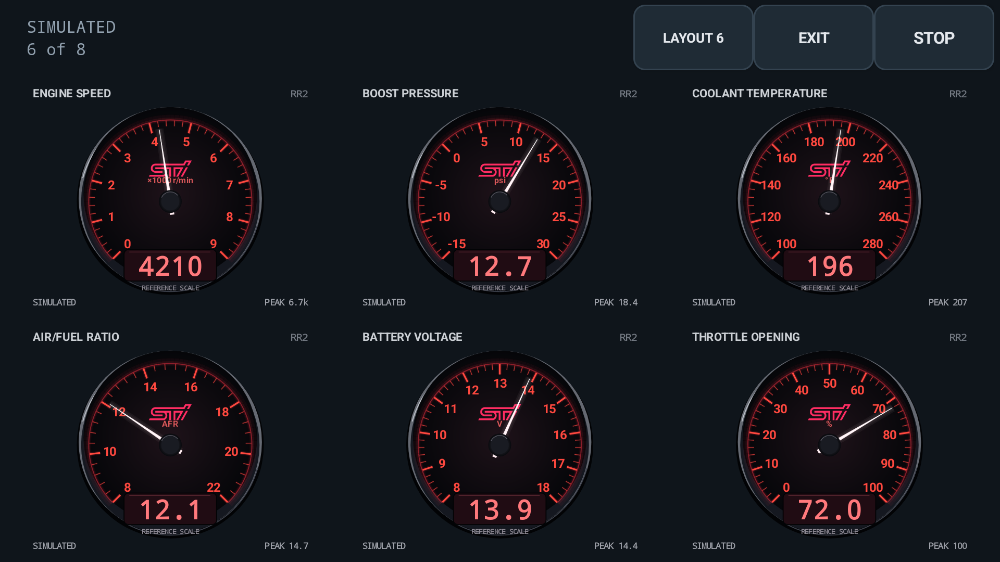
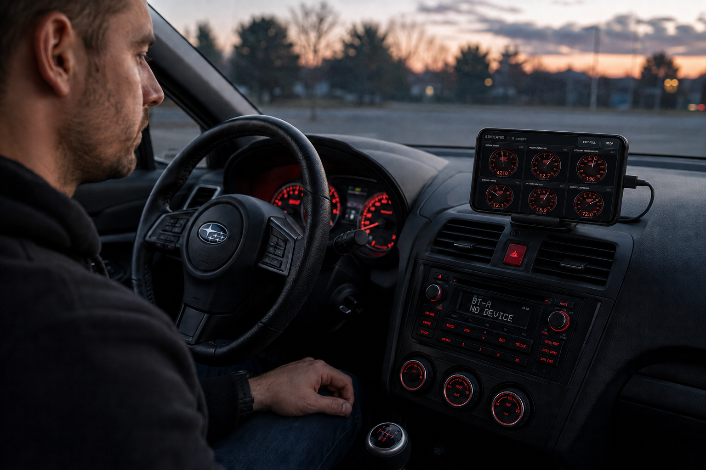

# Full-screen mounted gauges — 1.1.3 development source

Open **GAUGES** to configure the display while parked: layout, channel assignments,
default style, per-channel styles, demo Show/Hide and peak reset are together here.
The searchable style gallery previews actual native gauge faces with labeled sample
readings. Tap a face to apply it, or cancel without changing anything.

Tap **FULL SCREEN** to hide the app tabs and Android status/navigation bars,
reduce outer padding, and keep the display awake while this Activity is visible.
It works on phone/tablet portrait and landscape layouts. Display cutout insets
remain protected on modern Android; the OS can retain window controls in multi-window mode.

In the setup screen, tap **LAYOUT** to choose **1, 2, 3, 4, 5 or 6 gauges**, in
portrait or landscape. Assign a channel and a style to each slot. Display channels
are saved separately for SSM and MUT-II and start empty; importing a logger profile
does not assign them. **USE LOGGER CHANNELS** explicitly copies the first six logger
selections in order. Slots outside a smaller layout remain saved for later.
Style overrides are saved per channel/protocol; choosing the default style does not
overwrite individual styles. Each channel's picker can restore **Use default**.

These choices affect display only: they do not add ECU requests or change the CSV.
All logger-selected channels continue recording. An assigned channel without incoming
readings shows **NO DATA**, not a simulated value. To receive that channel, include
it in the Logger acquisition setup before starting the session. Unassigned slots do
not occupy fullscreen space; assigned channels without data retain an unavailable face.

The mounted grid fills the available area with no persistent controls and no
scrolling. It compares balanced row arrangements for the current viewport and
face shape, choosing the largest combined face area. Incomplete rows use their
full width; faces scale uniformly without stretching or cropping. Portrait,
landscape and window-size changes trigger a fresh fit. Some space around a face
is intentional to preserve its proportions.

Full-screen gauges use a seamless presentation: no surrounding card backgrounds,
rectangular borders, header strips or decorative header/footer divider lines.
The instruments share one dark backdrop. Dial bezels, scales, numeric display
windows and style-specific artwork remain part of the gauge itself, and warning,
stopped/stale and unavailable-reading text stays visible. Exiting full screen
restores the regular cards without replacing gauge instances or the recording.
The same borderless presentation is used in JavaFX and Compose mounted views;
their normal workspace theme is restored on exit.

Tap anywhere on the mounted gauges or backdrop to reveal an overlay menu with
**EXIT FULL SCREEN** and **STOP**. The menu hides after five seconds of inactivity;
another tap resets the timer. Android's accessibility timeout preference is respected.
Fullscreen taps reveal controls, never a style picker. **EXIT FULL SCREEN** or Android
Back restores gauge setup. **STOP** stops the same recording without leaving mounted mode. The display
stays awake even when stopped or displaying explicitly simulated data. Entering
mounted mode does not connect USB, identify an ECU, start recording, or create data.
Channel and style settings remain in GAUGES setup. View switches retain the gauge grid,
recording owner and CSV writer. Stopped/stale labels and unavailable readings are
not hidden by full-screen mode.

This is an awake application display, not Android's lock-screen Always On Display.
It does not change system timeout preferences, force maximum brightness, disable
the lock screen, or prevent deliberate power-button sleep. Going to Home releases
the display-awake flag; returning to the existing mounted view restores it.
Leaving full screen releases it, including during recording. The ordinary Gauges
and Logger tabs do not keep the screen awake. A new Activity/process starts in the normal LOGGER view; mounted mode
never causes an automatic logging restart. Ordinary orientation changes retain the
current Activity. Background recording is a [separate service feature](ANDROID_BACKGROUND_RECORDING.md).

Android 11+ uses `WindowInsetsController` with transient bars by edge swipe;
Android 8–10 use the legacy immersive-sticky fallback. Android 13+ registers a
predictive-back callback only while mounted, with the older Back override retained
for API 26–32. See Android's [immersive-mode guidance](https://developer.android.com/develop/ui/views/layout/immersive)
and [keep-screen-on contract](https://developer.android.com/develop/background-work/background-tasks/awake/screen-on).

The `gauge-setup` automation phase covers explicit channel assignment/copy, gallery
search and selection, per-channel persistence, unavailable channels, menu reveal/reset/
timeout/exit and unchanged simulated capture. `gauge-demo-toggle` covers Show/Hide.
The `mounted-fullscreen` automation phase checks hidden/restored system bars,
idle/stopped keep-awake, Home/return, Back/LOGGER exit and retained gauge identity.
The synthetic service tests also switch full screen during disk-backed capture.
The `mounted-layouts` phase checks every count in portrait and landscape with
both legacy and custom faces, retains hidden gauges/profile identity, uses the
native count picker, checks restoration, and captures 24 actual screenshots.
The `seamless-gauges` phase checks native transparent outer-edge pixels for all
25 Android styles and verifies that regular card pixels return on exit.
The `live-gauges` phase also changes counts during synthetic capture and verifies
the original session and exported CSV. Portable layout checks cover 108
viewport/count/face combinations, including tiny and zero-sized viewports.
These checks do not establish real-phone thermal behavior, sunlight readability,
USB stability or vehicle safety. Set up while parked; do not adjust it while driving.
This feature is not in the published 1.1.2 packages.

The collection now contains 25 selectable styles, including Apex 24, Ion OLED,
Loop Drive and Chrono Roll. [Design references and renderer checks](GAUGE_DESIGN.md)
cover the shared Android/desktop artwork. Desktop/handheld now have their own
[searchable galleries and saved channel styles](DESKTOP_GAUGE_STYLES.md), plus
[independent slots and fitted layouts](DESKTOP_GAUGE_DISPLAY.md). Desktop awake
support and remaining native-window qualification are still pending.

The calculated-gauge fixture explicitly copies Logger channels into display slots;
profile loading alone must not perform that action. Instrumentation flushes its
preference fixtures before terminating the target process and checks display choices
after restart/reinstall. This does not turn profile loading into automatic display
selection, or alter normal asynchronous preference saves in the application.

September 6: the complete emulator lifecycle script passes, including menu
reveal/reset/timeout/exit, all 25 seamless styles, 1–6 portrait/landscape layouts,
session/CSV continuity, background capture and process-death recovery. This local
run reinstalls the same automation APK; it does not establish a version-increment
upgrade. Hosted checks build separate initial/upgraded automation versions.
Fresh-install testing reproduced the earlier fixture-persistence failure before
the instrumentation flush fix. No physical adapter or vehicle was used.

## Actual Android layouts

[Gauge setup](images/android-gauge-setup.png) ·
[Visual style picker](images/android-gauge-style-picker.png) ·
[Mixed-style fullscreen](images/android-fullscreen-mixed-gauges.png) ·
[Tap-to-reveal menu](images/android-fullscreen-tap-menu.png).
These four native emulator captures show the consolidated setup and explicitly
simulated test readings, not vehicle data. Reproduce with `gauge-setup`.

[Five-gauge portrait screenshot](images/android-mounted-five-portrait.png).
These are native emulator screenshots with explicitly simulated values, not
vehicle-test results. The complete 24-image set is reproducible with the
`mounted-layouts` instrumentation phase.

## Illustration

This illustrative product mockup uses an actual Android screenshot as its
screen reference. It is not a photograph of a vehicle test or exact hardware fitment.
It predates the count-picker controls and seamless presentation described above.
The app display uses simulated readings. See the
[native gauge collection](images/all-mobile-gauge-styles.png) for gauges rendered by the app.
