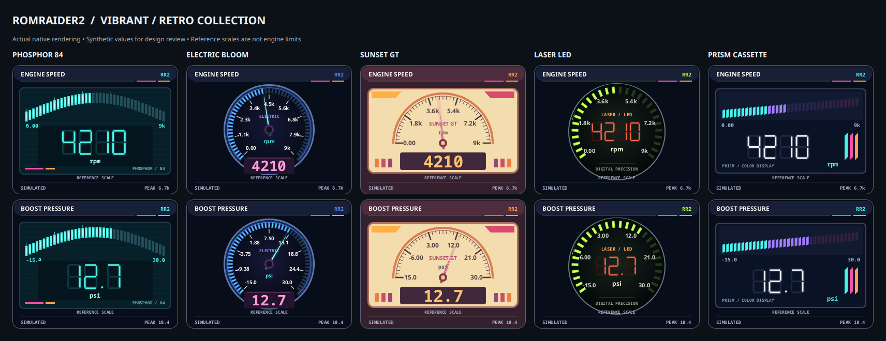

# Dashboard instruments

RomRaider2 includes nine original instrument faces plus STI Night and Evolution Night
alongside its existing themes. Development source 1.1.3 adds five more vibrant/retro
styles below; these five are not in the published 1.1.2 packages.
Choose a face in the Logger dashboard, then switch to **Gauges** on Android or
**Gauges only** in the JavaFX or Compose desktop/handheld logger. Configure the display while
parked. This view is not a replacement for the vehicle's instruments or warnings.

| Face | Visual structure |
| --- | --- |
| Rally Precision | Dark circular dial, white graduations, red pointer |
| Circuit Stack | Stepped amber column and large numeric reading |
| Retro VFD | Green seven-segment numerals and horizontal level bar |
| Club Sport | Light dial, dark graduations and red pointer |
| Sweep Ribbon | Rising horizontal ribbon, marker and large reading |
| Twin Arc | Cyan current-value arc and separately labeled violet measured-peak arc |
| Amber Matrix | Dot-matrix numerals and discrete level indicators |
| Vector HUD | Minimal numeric display with a vertical scale and marker |
| Turbo Pod | Offset circular dial paired with a separate digital display |
| STI Night | Red-lit dial, STI wordmark, shaded bezel and bright tapered needle |
| Evolution Night | Metallic bezel, warm-white numerals and red-orange tapered needle |
| Phosphor 84 | Teal phosphor-style glass, cyan segmented digits and arched level bars |
| Electric Bloom | Blue illuminated ring, cyan pointer and pink numeric window |
| Sunset GT | Cream face, berry pointer, amber numerals and period-inspired stripes |
| Laser LED | Smoked circular face, lime level segments and red-orange digits |
| Prism Cassette | Cyan/violet/pink rising segments, white digits and cassette-era stripes |

Android 1.1.3 adds [full-screen mounted display and foreground keep-awake](ANDROID_MOUNTED_DISPLAY.md).
All five styles apply to the selected channels, not fixed RPM/boost-only gauges.

[View all 21 mobile themes in one labeled, native-rendered collection sheet](images/all-mobile-gauge-styles.png).
The reproducible `gauge-contact-sheet` instrumentation phase draws actual Android
gauge views. `gauge-gallery` and `gauge-gallery-landscape` capture the full-screen app.

## Research and design decisions

The design study used manufacturer material, not copied gauge skins. Subaru's
[WRX/STI quick guide, gauges section](https://techinfo.subaru.com/stis/doc/ownerManual/MSA5B1905A_STIS.pdf)
separates the instruments from informational, caution and immediate-attention
indicators. Mitsubishi's indexed [2015 Evolution press kit](https://media.mitsubishicars.com/presskits/2015-lancer-evo-press-kit)
describes a high-contrast speedometer/tachometer cluster; direct access to that
press site was restricted during this review. Those references informed the
restrained dark-face, clear-graduation designs—not vehicle-specific limits.

The aftermarket references included [Defi ADVANCE A1](https://defi.nippon-seiki.co.jp/products/advance_a1/),
[HKS Direct Bright Meter](https://www.hks-power.co.jp/en/product/electronics/meter/d_b_meter/index.html)
and [AiM MXG](https://www.aim-sportline.com/en/products/mxg/index.htm).
HKS's contrasting light/dark dial options informed the light-face alternative.
AiM's separate configurable alarm and shift indicators reinforced a design rule:
decoration must not masquerade as a configured alarm. These are historical and
visual references, not endorsements, compatibility claims or reproduced artwork.

The green segmented and amber dot-matrix treatments are RR2's interpretation of
retro digital instruments. The ribbon, split pod and dual arcs provide different
information layouts, not merely alternate colors. All faces are drawn in code.
The owner's subsequent premium pass adds the STI wordmark; see the
[brand provenance and notices](GAUGE_BRAND_NOTICES.md). No cluster photograph or
manufacturer font asset is embedded.

The later vibrant study adds the blue illumination and mixed analog/digital layout
of [BLITZ FLD](https://www.blitz.co.jp/products/meter/fldmeter.html), teal digital
instrument presentation from [Dakota Digital VFD3](https://www.dakotadigital.com/index.cfm/page/ptype=product/product_id=488/category_id=69/mode=prod/prd488.htm),
and the large digits/LED-ring structure of [AEM X-Series](https://www.aemelectronics.com/products/dashes_and_gauges/aem_performance_gauges/x_series_gauges/).
AEM labels several X-Series models best-sellers; that supports selecting established
market references, not a claim that display appearance caused their sales. Sunset
GT and Prism Cassette extend the brief with original cream/berry and multi-color
retro treatments. Colored segments show measured progress, not invented redlines.
No manufacturer product photograph, logo or face skin was copied into these five.

## Data meaning

- Numbers and units come from the selected logger conversion.
- Reference scales are display ranges, **not safe operating ranges**. Unknown
  units use a recent measured range instead of assuming psi, Fahrenheit or AFR.
- Invalid readings show a dash, not zero. Mounted live views blank stopped or
  stale readings after three seconds without a displayed sample. Measured peaks
  remain labeled as historical values, including Twin Arc's inner peak ring.
- Desktop warnings use the user's existing conversion-bound limits. Mobile
  faces do not invent warning thresholds. A red pointer is not a warning.
- Demonstration data is explicitly labeled **SIMULATED**. Opening the gauges
  view never initiates a connection, starts recording or generates live data.
- Android switches reuse the existing gauge views, logger session and CSV writer.
  Returning to the logger does not stop the session. Public Android 1.1.2 stops
  logging when leaving the app; 1.1.3 source separately adds
  [service-owned background recording](ANDROID_BACKGROUND_RECORDING.md).

## Implementation and validation

`GaugeFaceRenderer` in the portable module defines all sixteen added vector faces. Android,
JavaFX and Compose adapt its drawing operations to their native canvases.
The portable check exercises every face with finite, missing, infinite and
out-of-range values and invalid scales. Native UI checks cover rendering and
view-switch behavior without a vehicle. Synthetic tests do not establish real
vehicle timing, outdoor sunlight readability, USB stability or driving safety;
those remain supervised acceptance checks.

Android's `gauges` instrumentation phase exercises the simulated session across
every theme. `live-gauges` runs the actual `ReadOnlyLoggerSession` and streaming
CSV writer against an injected fake transport, checks that the file continues
growing, and asserts one identification and one deliberate transport close.
Both are part of the lifecycle regression script. `gauge-gallery` captures native
screens and rejects an obstructing window. JavaFX's mounted-gauge smoke test
checks published recording state, every theme switch, stale data and recovery.

The two night-cluster faces, Electric Bloom and Sunset GT interpolate only the needle for at most 100 ms.
Numeric readings, measured peaks, warnings and CSV recording are never interpolated.
First readings, invalid values, recovery and long gaps do not trigger a startup
sweep. Android respects disabled system animators; desktop rendering also accepts
`-Dromraider2.gauge.reduceMotion=true`.
